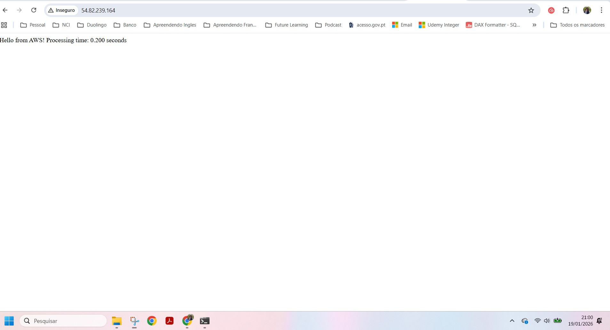
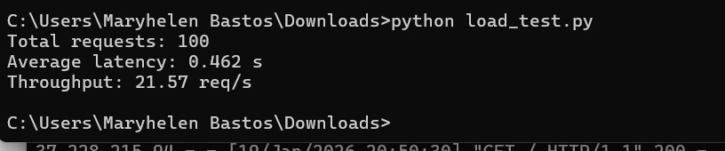

# Lab 01 – AWS Application Performance Testing

**Overview**  
This lab is part of the Master’s Degree in Cloud Computing at NCI and focuses on performance testing of a simple web application deployed on AWS.

**Objectives**
- Deploy a Python Flask application on AWS EC2
- Generate concurrent requests to evaluate performance
- Monitor CPU utilization using AWS CloudWatch

**Architecture Overview**  
An AWS EC2 instance running a Flask application, monitored using AWS CloudWatch.

**Technologies and Tools**
- AWS EC2
- AWS CloudWatch
- Python
- Flask

**Description**  
A Python Flask application was deployed on an EC2 instance and tested under concurrent load to observe latency, throughput, and CPU utilization.

**Outputs**
- Flask application successfully running on AWS EC2  
  
- Load testing script execution and performance output  
  
- CPU utilization observed in AWS CloudWatch during the load test  
  

**Learning Outcomes**
- Understanding cloud performance testing
- Monitoring cloud infrastructure metrics
- Deploying applications in AWS environments

**Conclusion**  
This lab provided hands-on experience with cloud-based application deployment and performance analysis.
