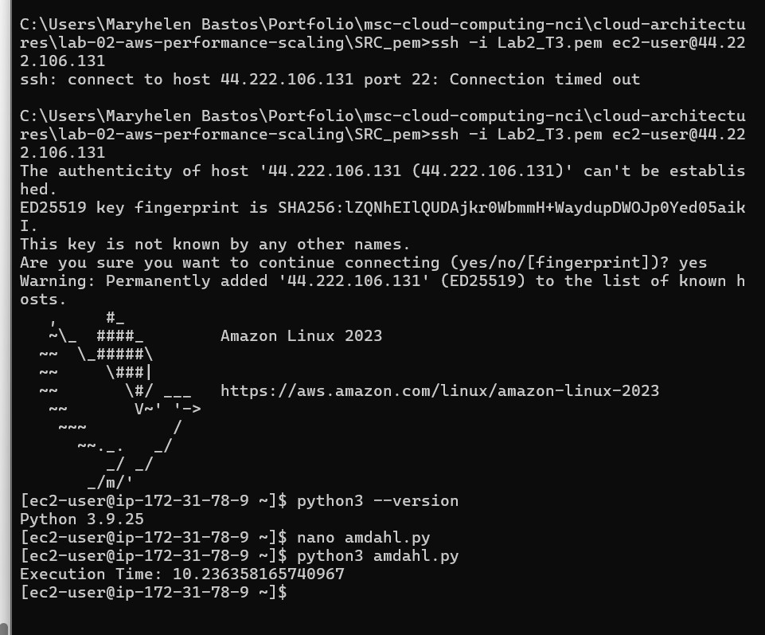
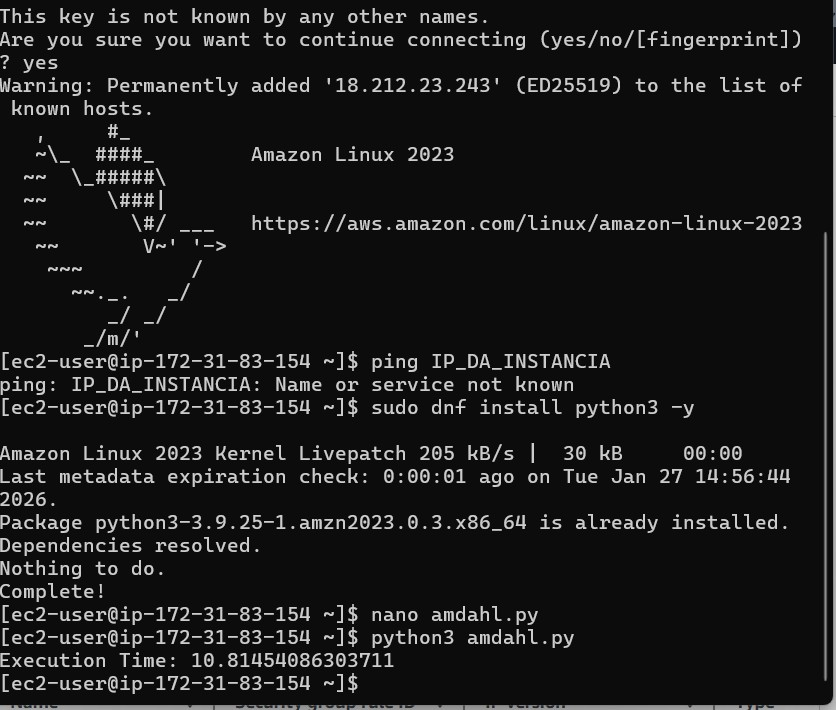
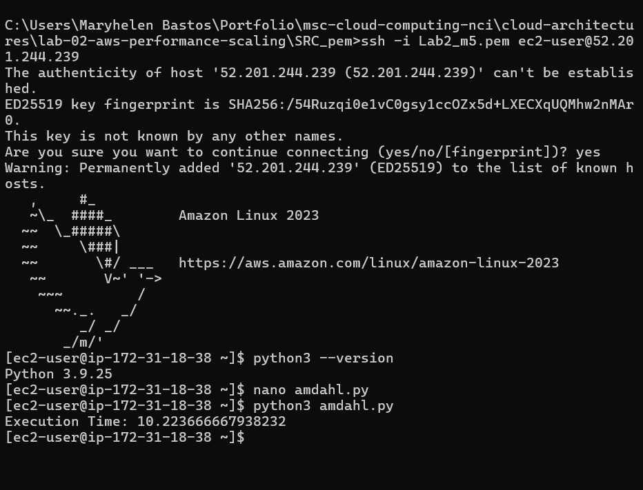
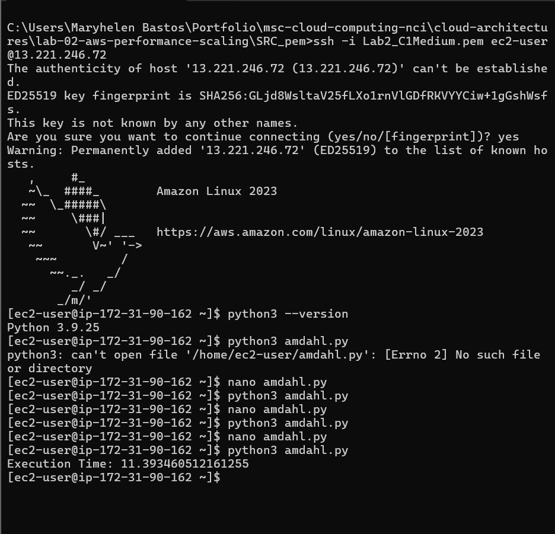

# Lab 02 – AWS Performance Scaling and Amdahl’s Law

**Overview**  
This lab is part of the Master’s Degree in Cloud Computing at NCI and focuses on evaluating application performance scaling on AWS EC2 using different instance types, applying Amdahl’s Law concepts.

**Objectives**
- Deploy and run a CPU-bound Python workload on AWS EC2
- Compare execution time across multiple EC2 instance types
- Analyze performance scaling and speedup
- Understand the limitations of parallel execution using Amdahl’s Law

**Architecture Overview**  
Multiple AWS EC2 instances with different instance types were launched.  
Each instance executed the same Python workload to measure execution time and compare performance.

**Technologies and Tools**
- AWS EC2
- Amazon Linux 2023
- Python 3
- SSH
- Amdahl’s Law

**Description**  
A Python script simulating a CPU-intensive workload was executed on different EC2 instance types (T3, T3 Large, M5 Large, and C1 Medium).  
Execution times were collected and compared to analyze scalability and performance behavior.

**Outputs**
- EC2 instances running with different instance types  
  

- Execution time on T3 instance  
  

- Execution time on T3 Large instance  
  

- Execution time on M5 Large instance  
  

- Execution time on C1 Medium instance  
  

- Security group inbound rules configuration  
  

**Learning Outcomes**
- Understanding performance scaling in cloud environments
- Comparing different EC2 instance families
- Applying Amdahl’s Law to real workloads
- Interpreting execution time and speedup results

**Conclusion**  
This lab demonstrated how EC2 instance selection impacts application performance.  
The results show that performance gains are not linear, reinforcing the importance of Amdahl’s Law when scaling compute resources in the cloud.
