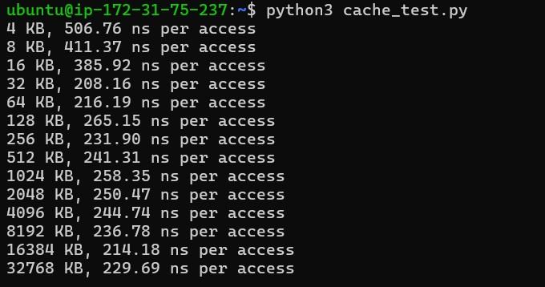
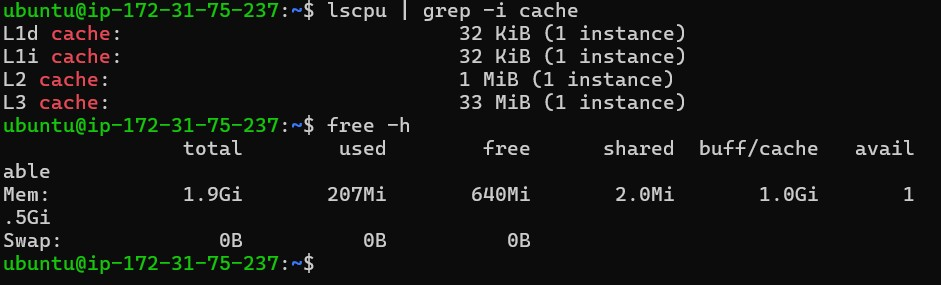
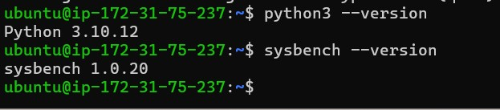
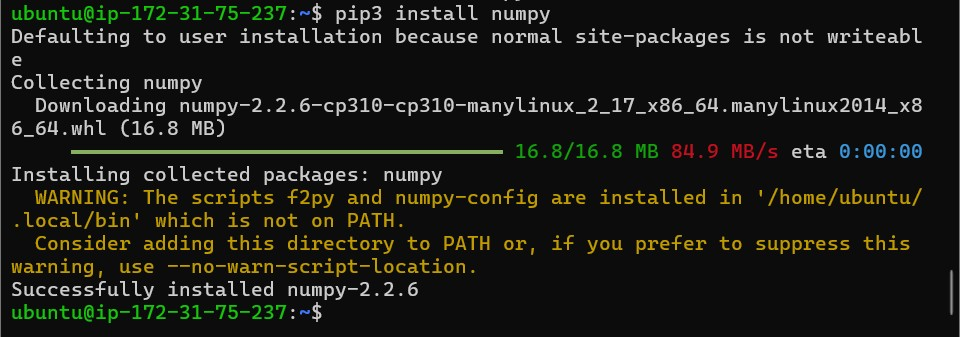
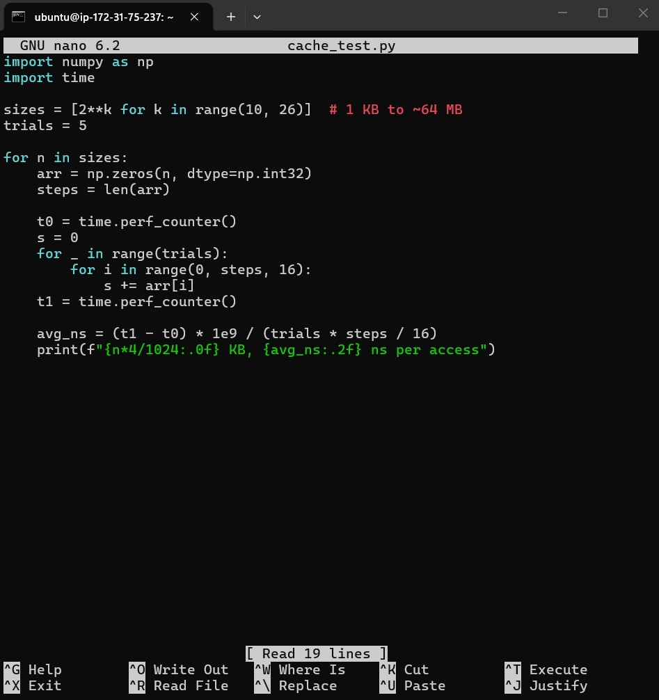
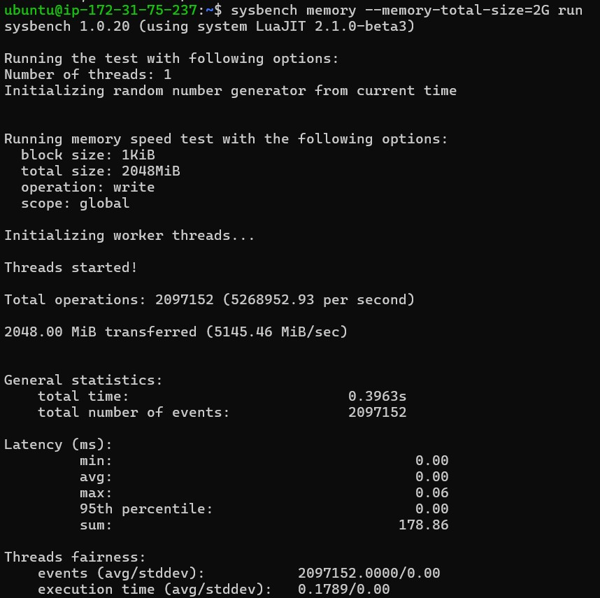

# Lab 03 – AWS Cache and Memory Performance Analysis

**Overview**  
This lab is part of the Master’s Degree in Cloud Computing at NCI and focuses on analyzing cache behavior and memory performance on AWS EC2 instances.

**Objectives**
- Analyze CPU cache hierarchy (L1, L2, L3)
- Measure cache access latency using a Python benchmark
- Evaluate memory throughput using Sysbench
- Understand the relationship between cache size and access latency

**Architecture Overview**  
An AWS EC2 instance running Ubuntu 22.04 was used to execute cache and memory performance tests using Python and Sysbench.

**Technologies and Tools**
- AWS EC2
- Ubuntu 22.04 LTS
- Python 3
- NumPy
- Sysbench

**Description**  
A Python script was used to measure memory access latency for increasing data sizes, revealing cache effects as data exceeds L1, L2, and L3 cache limits.  
Additionally, Sysbench was used to evaluate overall memory throughput and latency under a controlled workload.

**Outputs**
**Outputs**

- Python cache latency test execution  
  

- Cache latency results for increasing memory sizes  
  

- CPU cache hierarchy information  
  

- Python and Sysbench version verification  
  

- NumPy installation confirmation  
  

- Cache test Python script  
  

- Memory throughput benchmark using Sysbench  
  

**Learning Outcomes**
- Understanding CPU cache hierarchy and behavior
- Measuring cache latency and memory throughput
- Observing cache performance impact on memory access
- Using benchmarking tools in cloud environments

**Conclusion**  
This lab demonstrated how cache size and memory hierarchy significantly affect application performance.  
The experiments highlight the importance of cache-aware programming and memory benchmarking when designing high-performance applications in cloud environments.
