# Lab 04 – AWS EC2 Automation and Web Server Deployment

**Overview**
This lab is part of the Master’s Degree in Cloud Computing at NCI and focuses on provisioning, configuring, and automating AWS EC2 instances using AWS CLI and Python (boto3).

---

**Objectives**

* Launch EC2 instances using AWS CLI
* Configure AWS authentication credentials securely
* Install and validate a web server on EC2
* Automate instance lifecycle using Python
* Query AWS resources dynamically
* Terminate instances programmatically

---

**Architecture Overview**
An AWS EC2 instance running Amazon Linux 2023 was used as a control node to execute AWS CLI commands and Python automation scripts. Additional EC2 instances were launched dynamically, configured automatically, validated through browser access, and terminated programmatically.

---

**Technologies and Tools**

* AWS EC2
* AWS CLI
* Python 3
* Boto3
* Amazon Linux 2023
* Nginx
* SSH

---

**Description**
The lab began with configuring AWS CLI credentials and setting the default region. Using command-line tools, EC2 instances were launched and verified. A Python script using boto3 was then executed to automate the creation and termination of instances.

A web server (Nginx) was installed to validate connectivity and server functionality. The successful execution confirmed that instances could be provisioned, configured, tested, and removed automatically using infrastructure automation techniques.

---

**Outputs**

* AWS CLI credentials configuration
  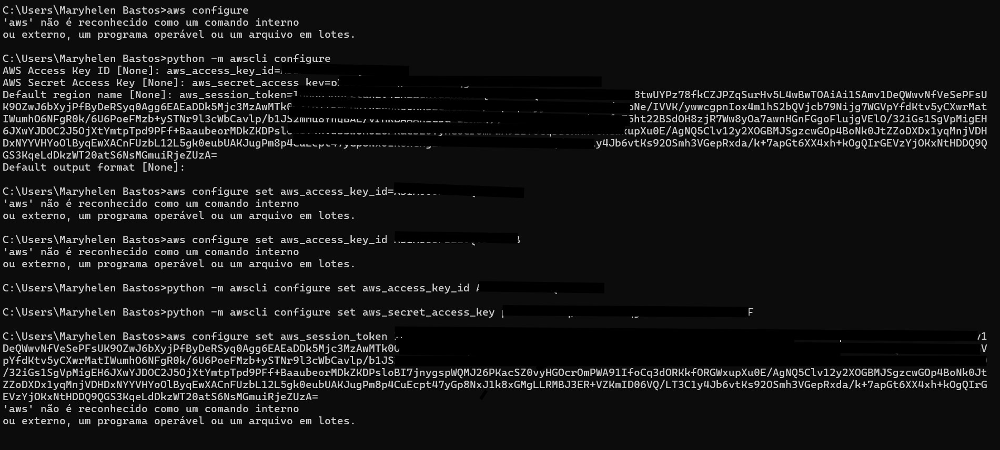

* Region configuration
  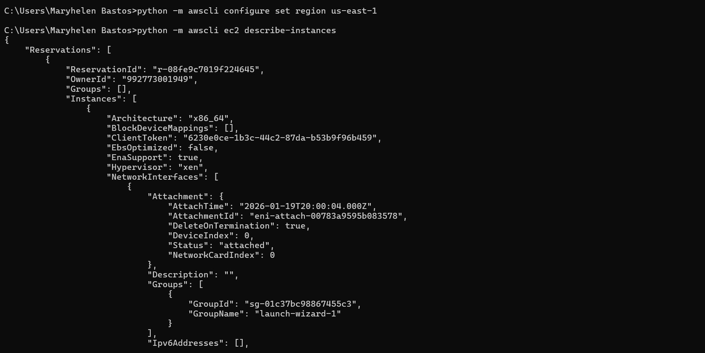

* Environment variables exported
  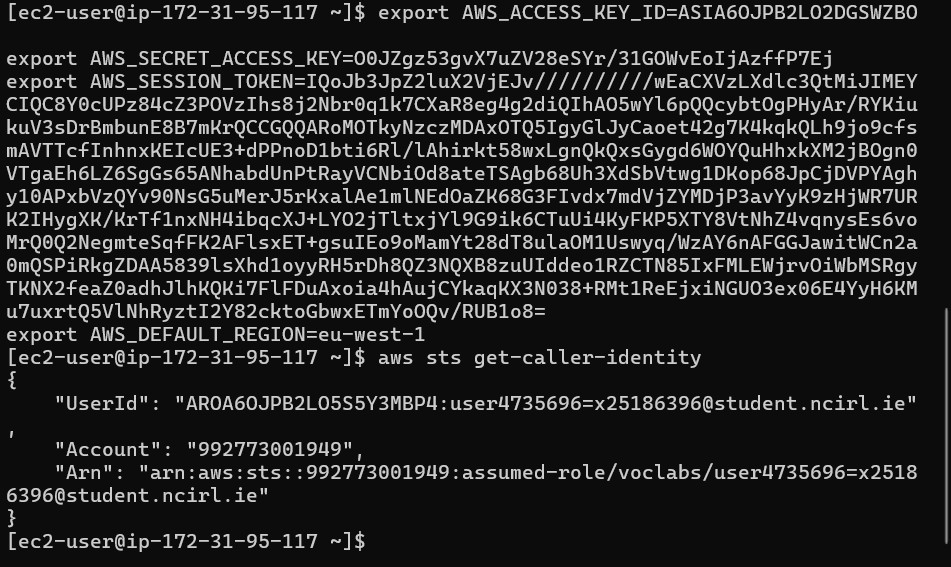

* Python version verification
  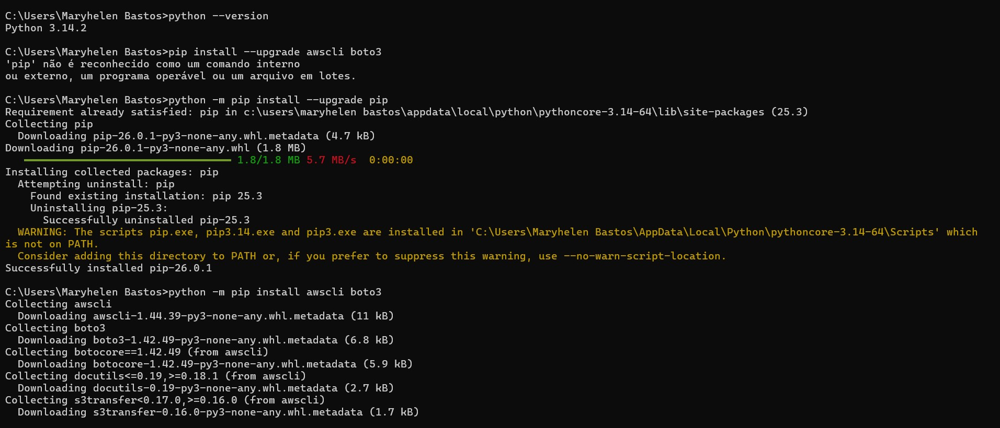

* pip installation
  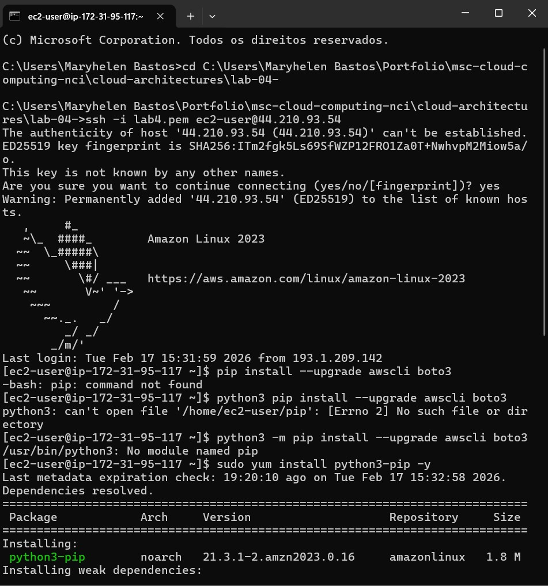

* boto3 installation
  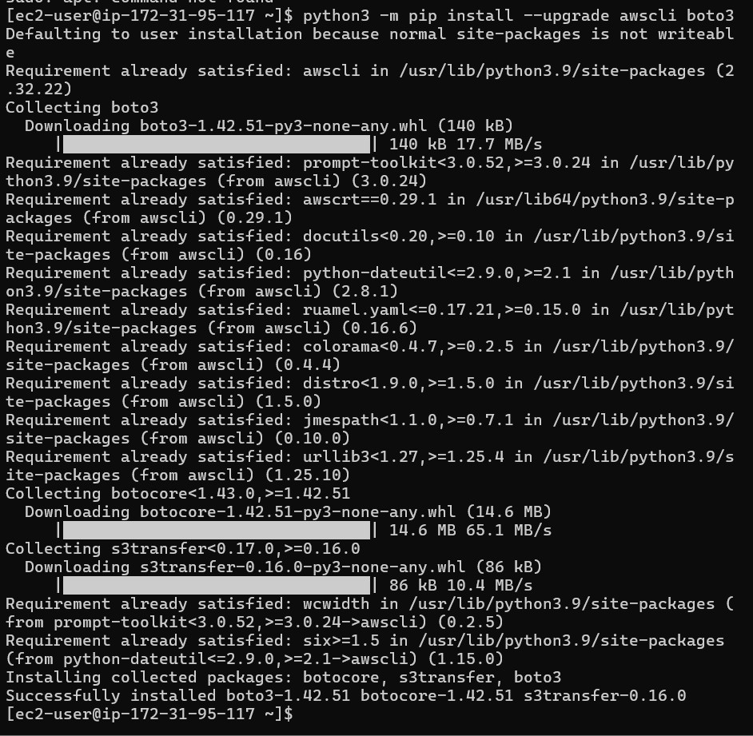

* Key pair list via CLI
  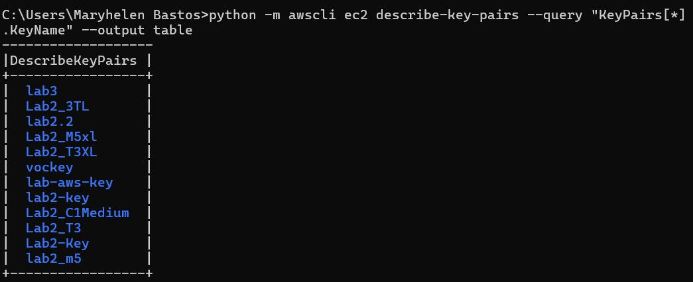

* Security groups list
  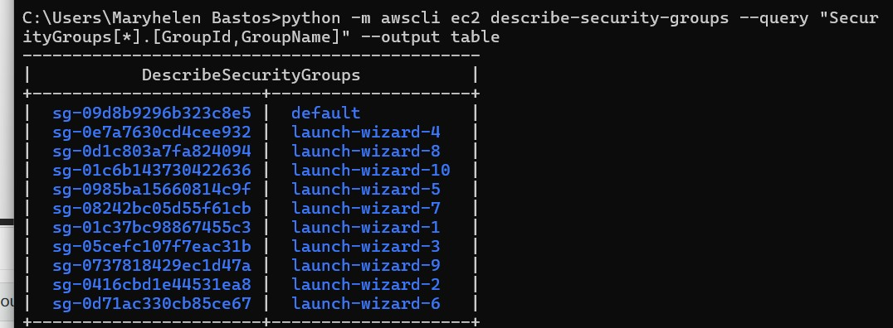

* EC2 instance launched via CLI
  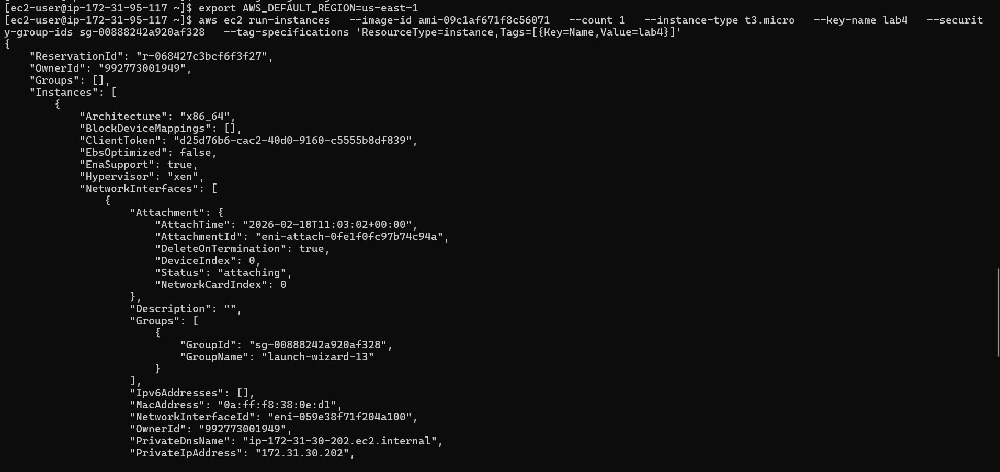

* Instance launched and terminated automatically
  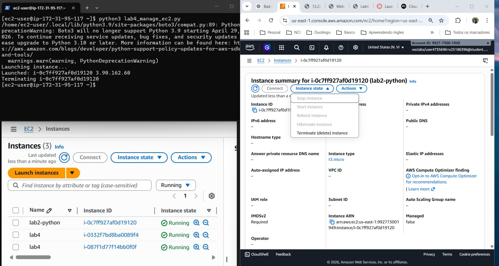

* Nginx installation
  

* Nginx running in browser
  

* Custom HTML test page
  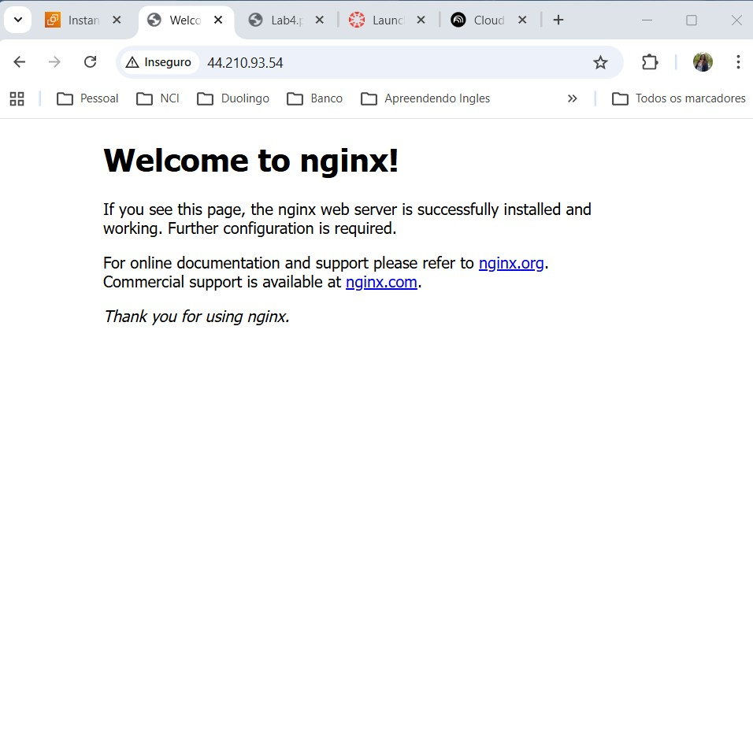

* Second instance running
  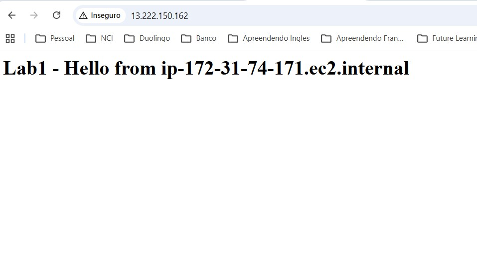

* EC2 console instance list
  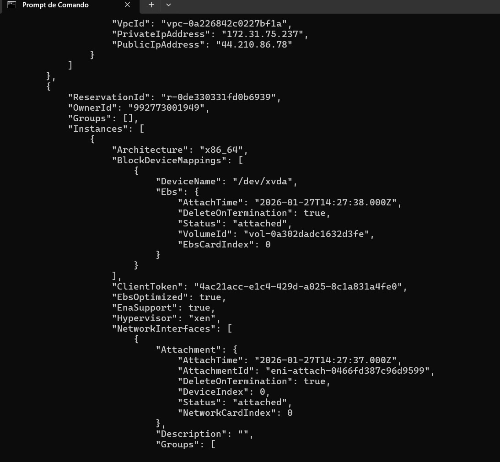

* Latest Amazon AMIs list via CLI
  

---

**Learning Outcomes**

* Understanding how to launch and manage EC2 instances via CLI
* Automating infrastructure using Python scripts
* Configuring cloud authentication securely
* Installing and validating web services on cloud VMs
* Querying AWS resources programmatically
* Managing instance lifecycle dynamically

---

**Conclusion**
This lab demonstrated how cloud infrastructure can be provisioned, configured, validated, and terminated automatically using scripting and command-line tools. The exercise highlights essential real-world cloud engineering skills such as automation, infrastructure lifecycle management, and programmatic control of cloud resources.
