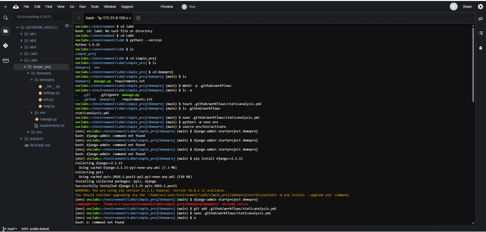
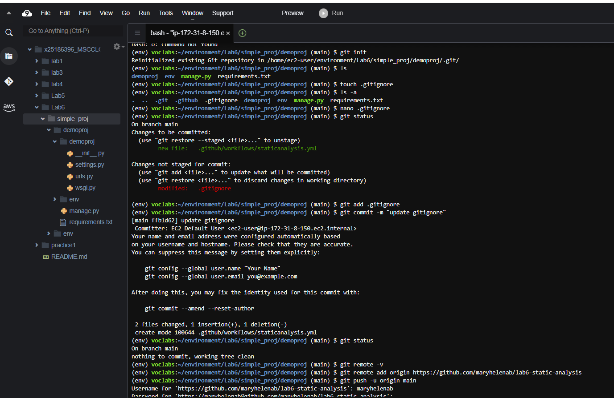
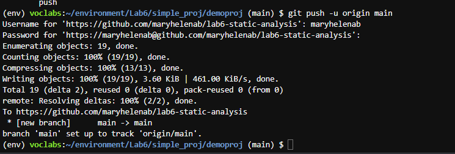
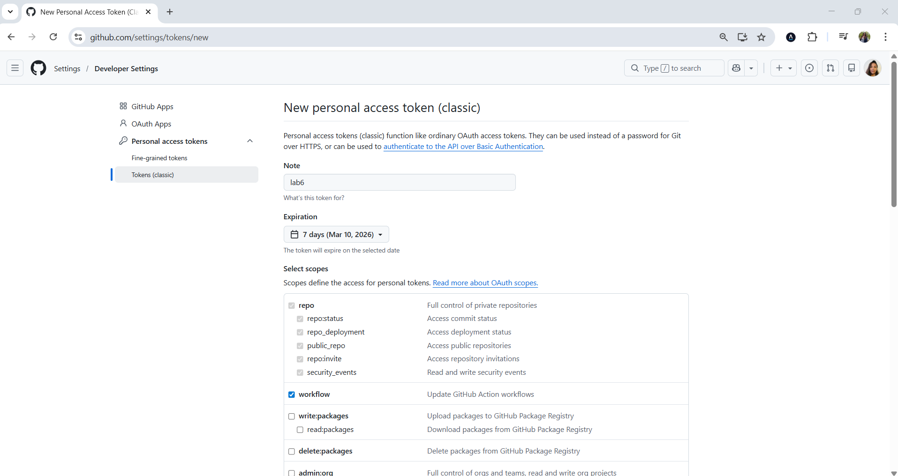
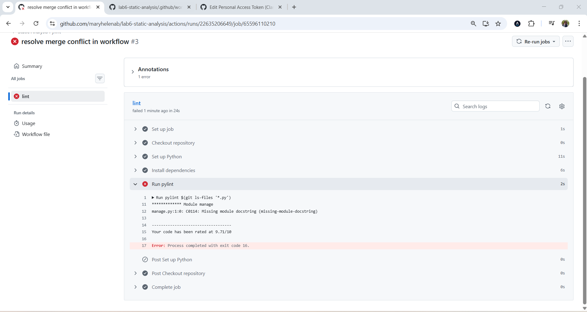
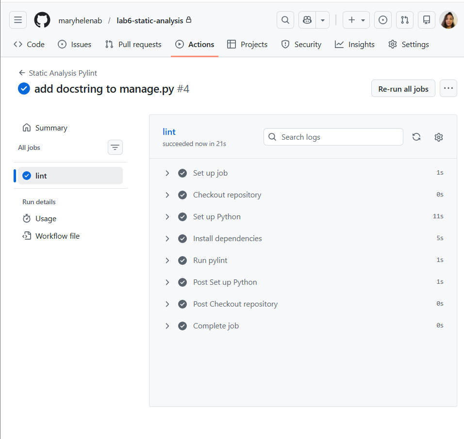
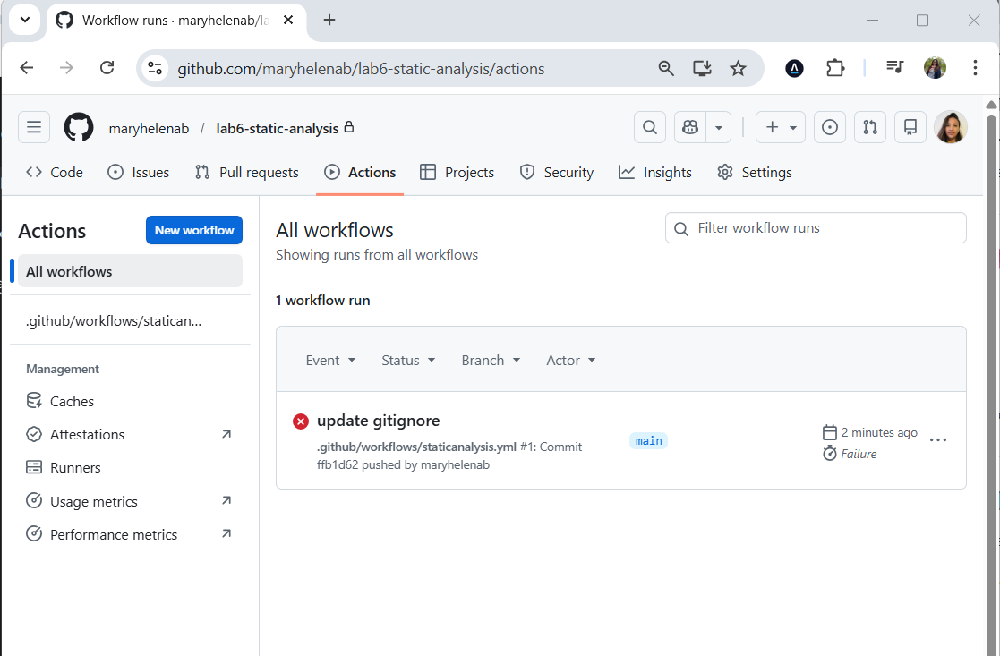
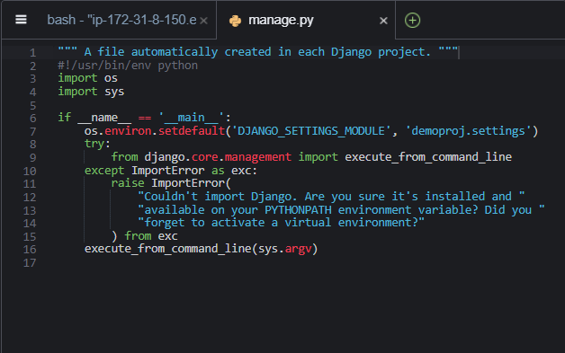

# Cloud Platform Programming – NCI

This lab is part of the **Cloud Platform Programming** module of the **Master’s Degree in Cloud Computing** at the **National College of Ireland (NCI)**.

The goal of this lab is to introduce **Continuous Integration (CI)** concepts and demonstrate how automated code quality checks can be implemented using **GitHub Actions** and **Pylint** for Python projects.

---

# Lab 06 – Continuous Integration with GitHub Actions

This lab focuses on implementing a **Continuous Integration (CI) pipeline** using **GitHub Actions**.

A workflow was created that automatically runs when code is pushed to the repository. The workflow installs project dependencies and executes **Pylint**, a static code analysis tool that evaluates Python code for:

- code quality
- potential errors
- style violations
- missing documentation
- adherence to Python best practices

The workflow initially detects an issue in the project (a missing module docstring), which is then corrected. After fixing the issue, the workflow is executed again to confirm that the pipeline completes successfully.

---

# Key Concepts

This lab introduces several important concepts related to modern cloud development workflows:

- Continuous Integration (CI)
- GitHub Actions automation
- Workflow configuration
- Static code analysis
- Python code quality validation
- Automated pipelines for software projects
- Integration between Git repositories and CI tools

---

# Tasks Completed

The following tasks were performed during this lab:

- Creation of a **GitHub Actions workflow**
- Configuration of the `.github/workflows` directory
- Creation of a **CI pipeline for Python projects**
- Installation of project dependencies in the pipeline
- Installation and execution of **Pylint**
- Detection of code quality issues
- Identification of a **missing module docstring**
- Correction of the issue in `manage.py`
- Re-execution of the pipeline
- Confirmation of successful workflow execution

---

# Workflow Configuration

The CI pipeline is defined in the workflow file:

```
.github/workflows/staticanalysis.yml
```

The workflow performs the following steps:

1. Checkout the repository
2. Setup the Python environment
3. Install project dependencies
4. Install the **Pylint** package
5. Run static analysis on the Python files
6. Report results in the **GitHub Actions interface**

The pipeline runs automatically whenever code is pushed to the repository.

---

# Project Structure

```
lab-06-create-github-workflow/
│
├── screenshots/
│   ├── create_github_workflow.png
│   ├── git_push_repository.png
│   ├── github_actions_workflow_run.png
│   ├── github_personal_access_token_creation.png
│   ├── manage_py_missing_docstring.png
│   ├── project_structure_cloud9.png
│   ├── pylint_failure_missing_docstring.png
│   └── pylint_pipeline_success.png
│
├── simple_proj/
│   └── demoproj/
│       ├── .github/
│       │   └── workflows/
│       │       └── staticanalysis.yml
│       │
│       ├── demoproj/
│       │   ├── __init__.py
│       │   ├── settings.py
│       │   ├── urls.py
│       │   └── wsgi.py
│       │
│       ├── env/
│       ├── .gitignore
│       ├── manage.py
│       └── requirements.txt
│
└── README.md
```

---

# Running the Project Locally

To run the Django project locally:

```bash
cd simple_proj/demoproj
python -m venv env
source env/bin/activate
pip install -r requirements.txt
python manage.py runserver
```

The development server will start at:

```
http://127.0.0.1:8000
```

---

# Workflow Execution Screenshots

### Project Structure in AWS Cloud9


### Creating the GitHub Actions Workflow


### Git Push Triggering the Workflow


### GitHub Personal Access Token Creation


### Pylint Failure – Missing Module Docstring


### Fixing the Issue in manage.py


### GitHub Actions Workflow Run


### Successful Pipeline Execution


---

# Learning Outcome

After completing this lab, the following skills were developed:

- Understanding how **CI pipelines automate development workflows**
- Using **GitHub Actions** to validate code automatically
- Applying **static analysis tools** to improve code quality
- Identifying and fixing Python best-practice violations
- Integrating automated checks into version control systems

These practices are widely used in modern **DevOps and cloud-based software development environments**.
