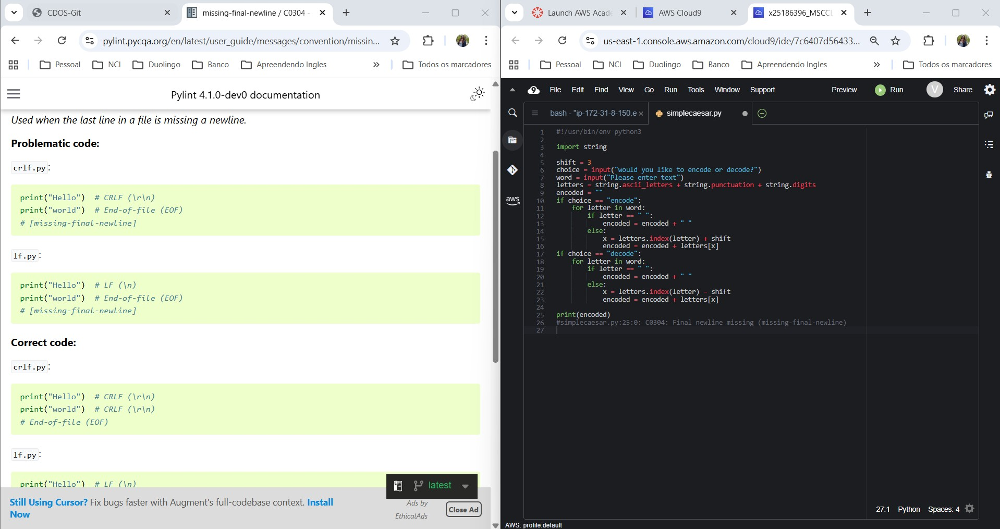
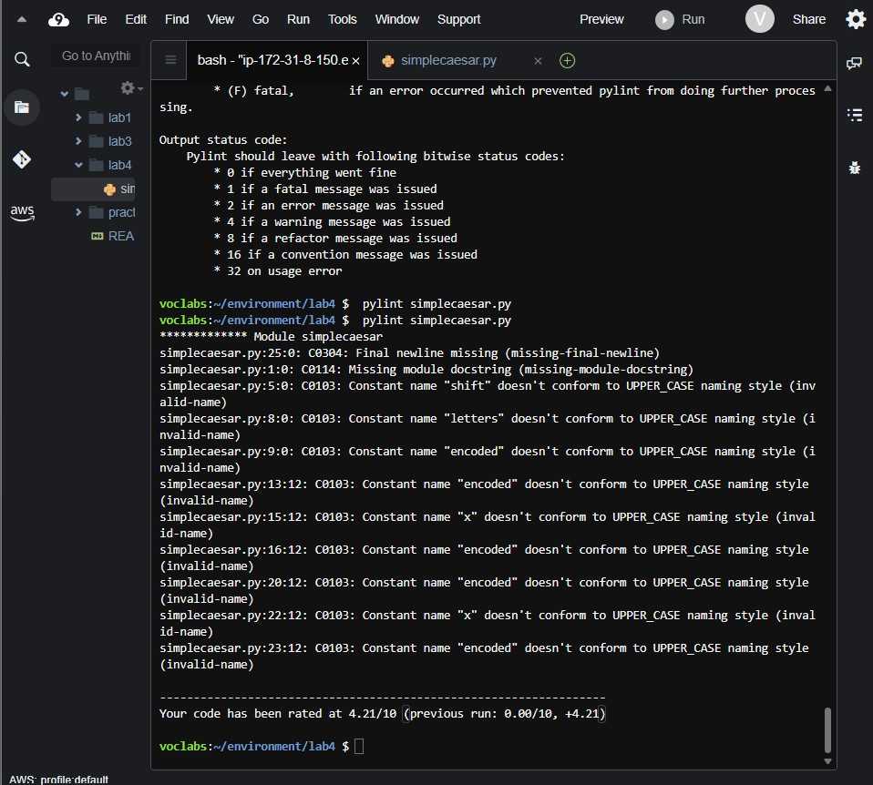

# Lab 04 – Static Code Analysis with Pylint

**Overview**
This lab is part of the Master’s Degree in Cloud Computing at NCI and focuses on analysing Python source code using static analysis techniques with Pylint. The goal is to identify coding issues, enforce standards, and improve code quality without executing the program.

---

## Objectives

* Install and configure Pylint in a development environment
* Analyse Python scripts using static analysis tools
* Identify errors, warnings, and style violations
* Interpret Pylint output messages
* Improve code quality and score by fixing issues
* Apply Python coding standards (PEP-8 aligned)

---

## Architecture Overview

The analysis was performed in an AWS Cloud9 environment configured for Python development. A Python script (`simplecaesar.py`) was analysed using Pylint, which scanned the source code and generated reports indicating code quality issues, naming violations, missing documentation, and syntax problems. The code was iteratively corrected until a higher quality score was achieved.

---

## Technologies and Tools

* Python 3
* AWS Cloud9
* Pylint
* pip
* Linux terminal

---

## Description

The lab began with verifying that pip was installed and compatible with the Python version. Pylint was then installed using pip and executed against a sample Python program implementing a Caesar cipher.

The initial analysis returned multiple messages including convention violations, naming issues, and missing documentation. Each message was reviewed and interpreted using Pylint’s help tools. Corrections were applied to the code, such as improving variable names, fixing syntax issues, and adding documentation.

After applying fixes, the script was re-analysed to confirm improvements in the score and reduction of reported issues. This iterative process demonstrated how static analysis tools help developers maintain clean, reliable, and standardized code.

---

## Outputs

* Pylint installation
  

* Initial analysis results
  

* Pylint error list
  

* Code corrections applied
  

* Final improved score
  

---

## Learning Outcomes

* Understanding static code analysis concepts
* Using Pylint to detect code issues automatically
* Interpreting linter messages and status codes
* Improving code readability and maintainability
* Applying Python naming conventions and standards
* Debugging code systematically using analysis tools

---

## Conclusion

This lab demonstrated how static analysis tools such as Pylint can evaluate code quality without executing a program. Through iterative testing and corrections, it became possible to detect errors early, enforce coding standards, and improve maintainability. These practices reflect real-world software engineering workflows and are essential skills for professional developers.
